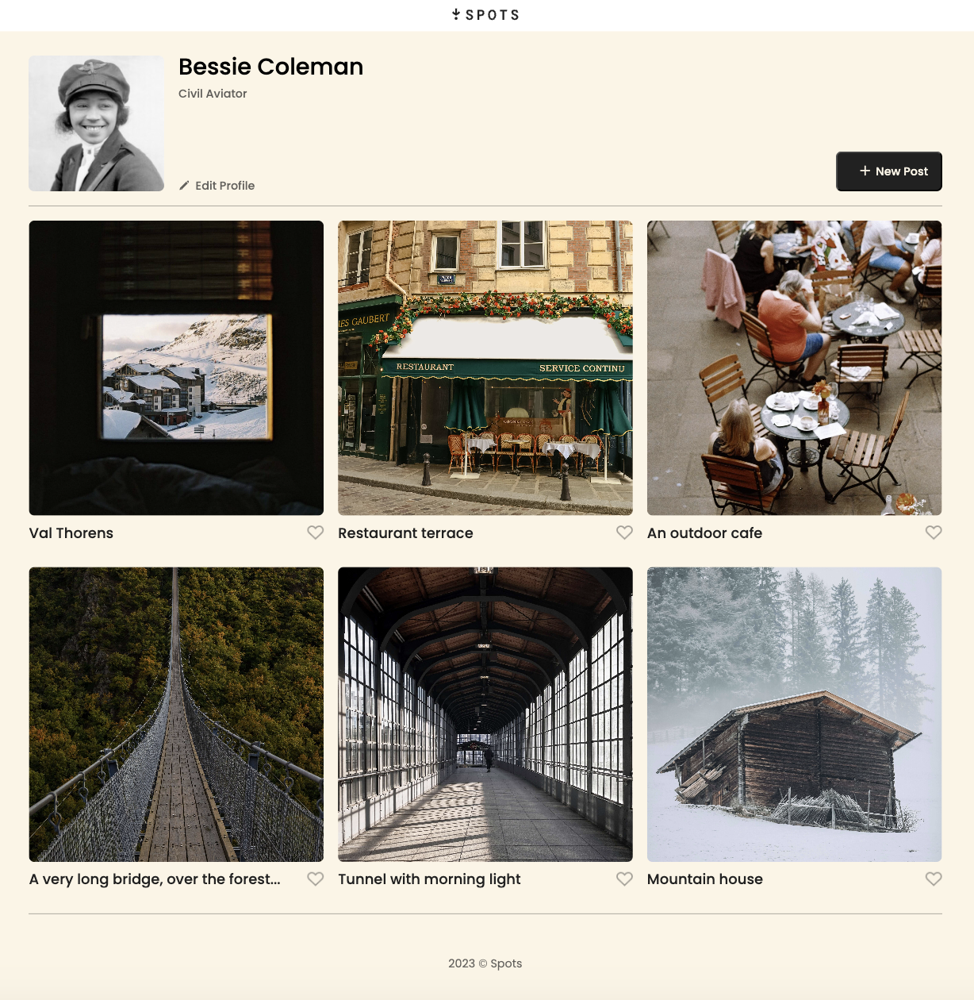
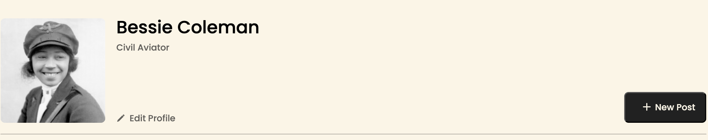
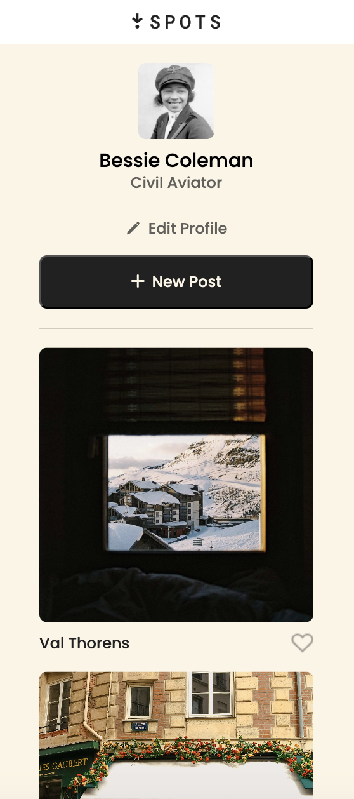
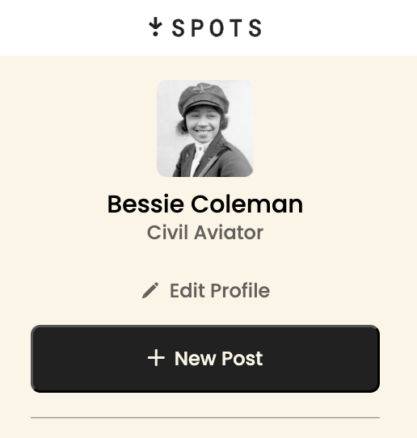
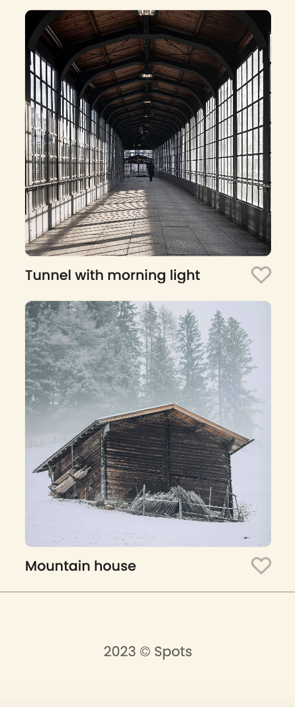

# Spots

## Description

**Spots** is a modern and elegant website showcasing various scenic locations. It features a clean and responsive design, allowing users to view images of different places, edit their profiles, and add new posts. The website is structured with a profile section, a list of location cards, and a footer.

---

## ⚙️ Technologies Used

- **HTML**: Structuring the website layout
- **CSS (BEM Methodology)**: Modular and scalable component styling
- **JavaScript (ES6+)**: Interactive features such as form validation, dynamic card rendering, and modal handling
- **Flexbox & Grid**: Responsive layout and design
- **Webpack**: Module bundling, asset management, and development server
- **PostCSS (Autoprefixer, CSSNano)**: CSS optimization
- **Babel**: JavaScript transpilation for cross-browser compatibility
- **Git & GitHub**: Version control and deployment

---

## 🧩 Features

- **User Profile**: Displays an avatar, name, and description
- **Edit Profile Button**: Opens a modal to update user info
- **Add New Post Button**: Allows users to add a new card with an image and caption
- **Cards Section**: Shows scenic location cards with like and delete options
- **Like Functionality**: Toggle likes on individual cards
- **Image Preview Modal**: Click on a card image to see a larger preview
- **Real-Time Form Validation**: Inputs must be valid before submission
- **Disabled Submit Button Until Valid Input**: Improves form UX
- **Responsive Design**: Optimized for desktop and mobile using media queries
- **Webpack Dev Server**: Live reloading and modern build tools

---

## 📸 Screenshots

  
  
  
  


---

## 🚀 Deployment

The project is hosted on **GitHub Pages**.  
👉 [Live Demo – Spots GitHub Pages Deployment](https://faridanelson.github.io/se_project_spots/)

---

## 🎥 Descriptive Video

A walkthrough video of the project is available here:  
📺 [Descriptive Video](https://drive.google.com/file/d/1BL5wsUZipyhruowlOKiAoG0ZwIwoPb14/view?usp=sharing)

---

## 👩‍💻 Author

**Farida Nelson**

---

## 🧪 Local Development & Webpack Setup

To run this project locally with Webpack Dev Server:

### 📝 Prerequisites

- [Node.js & npm](https://nodejs.org/) installed on your machine
- Git (if cloning from GitHub)

### 🚀 Installation Steps

```bash
# 1. Clone the repository
git clone https://github.com/faridanelson/se_project_spots.git
cd se_project_spots

# 2. Install dependencies
npm install

# 3. Run the development server
npx webpack serve
```
